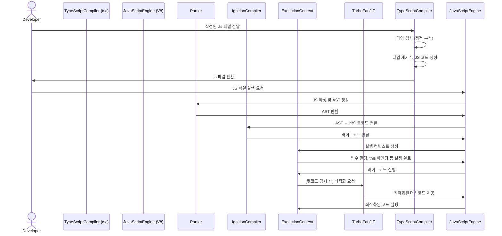

# 타입스크립트 란?
- 타입스크립트(ts)는 더 안전하고, 더 정교하게 JavaScript를 작성하게 해주는 개발자 구인 트랜스파일 언어 입니다.
- Microsoft 가 개발하여 든든하죠(?)


# 타입스크립트를 사용하는 이유
- **코드 안정성 증가 : 실수 방지, 명확한 인터페이스, 리팩토링 안전성**
- 자동완성, 타입 추론, 코드 탐색 등 용이
- 협업과 유지보수에 강점
- 최신 JS 기능 지원

# 타입스크립트가 자바스크립트로 변환되어 실행되는 과정 요약
```
TypeScript (.ts)
   │  작성
   ▼
tsc (TypeScript Compiler)
   │  트랜스파일: 타입 제거 + JS 생성
   ▼
JavaScript (.js)
   │  V8에서 실행
   ▼
JS 엔진 내부 처리
  ├─ 파싱 → AST
  ├─ 컴파일 → 바이트코드
  ├─ 실행컨텍스트 생성
  ├─ 실행
  └─ (필요 시) TurboFan JIT 최적화
```

# 조금 더 상세하게 보기 




